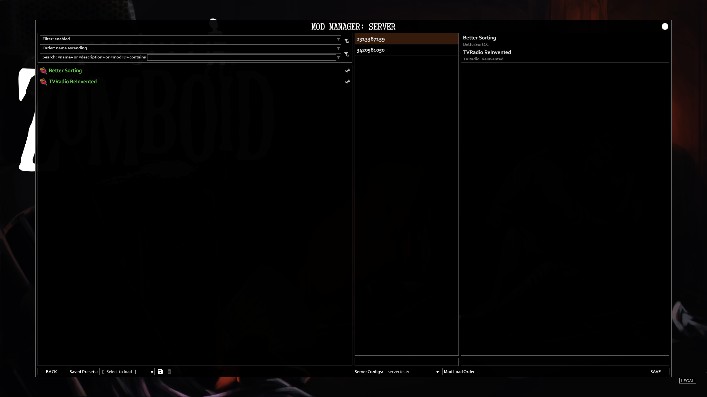
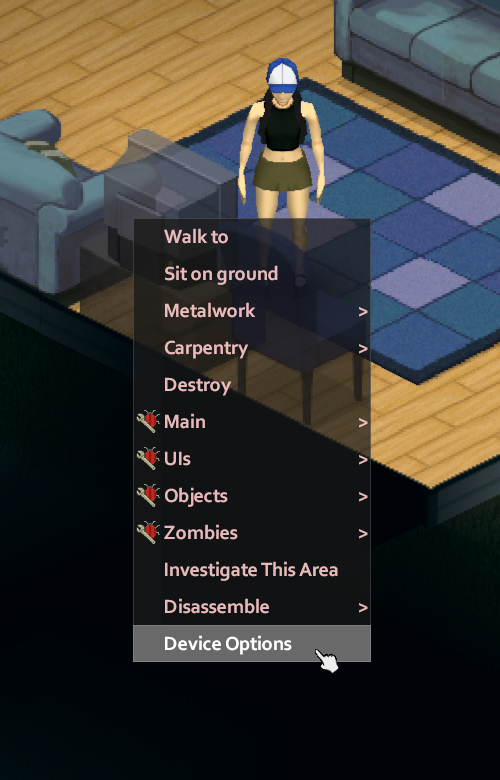
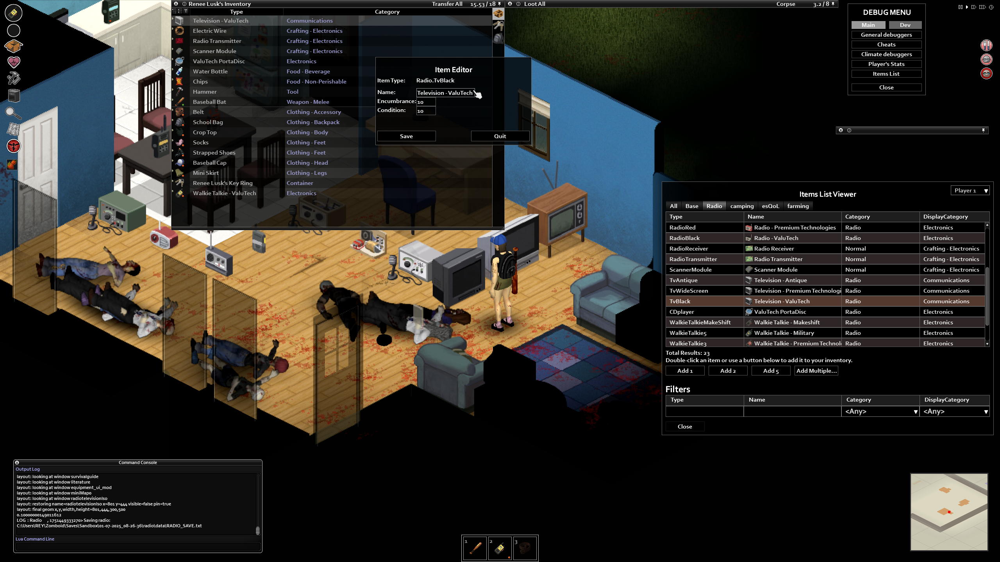
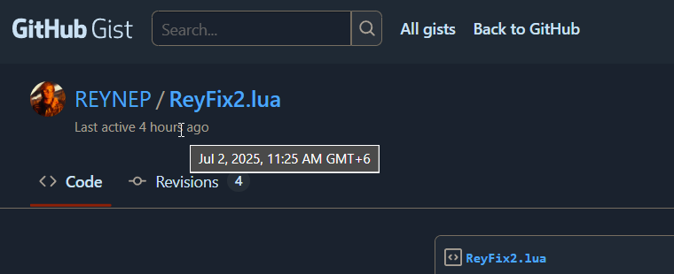

<div class="REY_ACADEMIA1">

## Project Zomboid `reyFix2`
### ⚔️ Conflicting Mods
1. TV & Radio ReInvented [🔗](https://steamcommunity.com/sharedfiles/filedetails/?id=3420581050)
2. Better Sorting        [🔗](https://steamcommunity.com/sharedfiles/filedetails/?id=2313387159)

### 🏞️ The Bug 🚨
<div align=center class="REY_TITLE_SUB1" style="font-size: 80%;">

✔️ = works ; ✖️ = TV & Radio ReInvented UI doesn't show

</div>

- ✔️ SinglePlayer
- ✖️ MultiPlayer (New Host)
    - ✔️ Only **TV & Radio ReInvented**
    - ✖️ 2 Mods ➡️ **TV & Radio ReInvented** + **Better Sorting**
- I disabled all other mods.
    

### 📝 Same Reports from others
- Steam Official Bug Reports Page 
    1. comment #43 [🔗](https://steamcommunity.com/workshop/filedetails/discussion/3420581050/592888305856604400/?ctp=3#c595151486404527618)
    2. comment #40 [🔗](https://steamcommunity.com/workshop/filedetails/discussion/3420581050/592888305856604400/?ctp=3#c595150321338027901)
    3. comment #39 [🔗](https://steamcommunity.com/workshop/filedetails/discussion/3420581050/592888305856604400/?ctp=3#c595150242677029314)
    4. comment #04 [🔗](https://steamcommunity.com/workshop/filedetails/discussion/3420581050/592888305856604400/#c592888305856659854)


<div class="REY_NOSHOW_PDF">

-------------------------------------------------------------------
<div align=center style="font-size: 50px; font-family: 'Quartist'; ">Page-Break</div>
</div>
<div class="REY_PAGEBREAK"></div>
<div class="REY_NOSHOW_PDF">

-------------------------------------------------------------------
</div>


### If, you are feeling exhausted ➡️ *See* TL:DR *in every page*
- I wrote this thingy, like a story of bug hunting investigation. **Linear TimeLine** + **Sharing Experience** in sorted order
---

### 🔍 Pin-Pointing
1. **Vanilla** TV Names are like `ValuTech Television` in **B41**
2. `BetterSorting` mod changes the name to `Television - ValuTech`
    - Both in **SinglePlayer** + **MultiPlayer**
    - This is done via
        - `BetterSorting\media\lua\shared\Translate\EN\ItemName_EN.txt`
        - `BetterSorting` loads it by "some" script "somewhere" along the way.... 🤔
        <div class="REY_BR_LIST1"></div>

3. `TV ReInvented`
    - Modifies Vanilla Implementation of `ISRadioWindow` (reimplements parts only)
        - 🛠️ `prerender()`
        - 🛠️ `readFromObject()`
    - Both has
        - `local checkName()` [not **Vanilla**]
            - which checks `getItemNameFromFullType()` against **"smth shady"**
            - ---
### 📜 Glossary
- `InventoryItemFullType` = e.g. `Radio.TvBlack` (**B41**) = `Base.TvBlack` (**B42** ReWrite)
- `InventoryItemFullType` = `ItemID`
- `InventoryItemFullType` = `getItemNameFromFullType()`
<div class="REY_BR_LIST1"></div>

- `Radio.TvBlack` = Unique Identifier for all **ValuTech Television** in **B41**
    - like, yk there are mods than can change
        - **name**
        - **category**
    - but `Radio.TvBlack` won't change
        - it's more like an Unique Static ID for the **"Asset"**
        <div class="REY_BR_LIST1"></div>

- **"smth shady"** = `nameD` in here
    ```lua
    function ISRadioWindow:readFromObject( _player, _deviceObject )
        local function checkName(name)
            return nameD == getItemNameFromFullType(name)       -- here "name" = "Radio.TvBlack"
        end

    -- REYNEP suggests a rename
    function ISRadioWindow:readFromObject(Player, IsoObject_Radio)
    ```
    - ---

### 🕵️ Investigation
- Right Hand Side = `getItemNameFromFullType()` = Pretty Consistent
    - `BetterSorting` Enabled
        - `SinglePlayer` = `Television - ValuTech`
        - `MultiPlayer` = `Television - ValuTech`
            - New Host = `Television - ValuTech`
            - Old Host = `Television - ValuTech`
            <div class="REY_BR_LIST1"></div>

    - `BetterSorting` Disabled
        - `SinglePlayer` = `ValuTech Television`
        - `MultiPlayer` = `ValuTech Television`
            - New Host = `ValuTech Television`
            - Old Host = `ValuTech Television`
            <div class="REY_BR_LIST1"></div>

- ###### So, our problem must have been with the LHS
- `nameD`
    - `BetterSorting` Enabled
        - `SinglePlayer` = `Television - ValuTech`
        - `MultiPlayer` = `ValuTech Television` 🚨
            - New Host = `ValuTech Television` 🚨
            - Old Host = didn't test
            <div class="REY_BR_LIST1"></div>

    - `BetterSorting` Disabled
        - `SinglePlayer` = `ValuTech Television`
        - `MultiPlayer` = `ValuTech Television`
            - New Host = `ValuTech Television`
            - Old Host = `ValuTech Television`
                - here, I was supposed to get an error 🚨 as per FAQ 🤔 
                  Old Hosted Servers initially started without `TV & Radio Inventory` aren't supposed to be working
            <div class="REY_BR_LIST1"></div>

- 🚨 = is where the issue is....
<div class="REY_BR_LIST1"></div>


### 🚴 TL;DR
<div align=center>

it's a `local checkName()` implementation issue! 🚨 with `nameD`
</div>

### 🤔 So, What issss really `nameD`?
```lua
-- UnModified Code from `Radio & TV ReInvented` + Added LineGaps only
function ISRadioWindow:readFromObject( _player, _deviceObject )
    self:clear();
    self.player = _player;
    self.device = _deviceObject;

    if self.device then
        self.deviceType = 
            (instanceof(self.device, "Radio")           and "InventoryItem" ) or
            (instanceof(self.device, "IsoWaveSignal")   and "IsoObject"     ) or
            (instanceof(self.device, "VehiclePart")     and "VehiclePart"   );
            
        if self.deviceType then
            self.deviceData = _deviceObject:getDeviceData();
            self.title = self.deviceData:getDeviceName();
        end
    end

    if (not self.player) or (not self.device) or (not self.deviceData) or (not self.deviceType) then
        self:clear();
        return;
    end

    local nameD = self.title

    .
    .
    . -- Function goes on
```
- #### Summary
    ```lua
    local nameD = _deviceObject:getDeviceData():getDeviceName();
    ``` 


<div class="REY_NOSHOW_PDF">

-------------------------------------------------------------------
<div align=center style="font-size: 50px; font-family: 'Iosevka Curly'; ">Page-Break</div>
</div>
<div class="REY_PAGEBREAK"></div>
<div class="REY_NOSHOW_PDF">

-------------------------------------------------------------------
</div>


### 😵‍💫 What do we do now?
- Well, the next best thing to do.... will always be....
    - to check **"What exactly is getting passed in?"**
    - well, fortunately in **lua** / **kahlua**, we can just do
        - `print(class-object-instance)`
    - ###### it's like a **based** principle that we should always follow

### 🧐 What exactly is getting passed in?
- Turns out, after I did the `print()`
    ```ruby
    zombie.iso.objects.IsoTelevision@747bfeba
    ```
    - This is what i got on the **debugMode** CommandConsole
    - *Note:- as i clicked on the TV inside a room in Zomboid / or / RightClick ➡️ `Device Options`
         

    - Functions / Member of **this lua class** is listed here
        - https://projectzomboid.com/modding/zombie/iso/objects/IsoTelevision.html

### 🚴 TL;DR 🧢 Under the Hood
```lua
return nameD == getItemNameFromFullType("Radio.TvBlack")
```
- basically translates to
```lua
return zombie.iso.objects.IsoTelevision:getDeviceData():getDeviceName() == getItemNameFromFullType("Radio.TvBlack")
```
- So 🚨 **the bug**, basically breaks down to the fact that
    - **these don't have the same value**
    - that is, **in Multiplayer**
    - that is, when `BetterSorting` **is enabled**


<div class="REY_NOSHOW_PDF">

-------------------------------------------------------------------
<div align=center style="font-size: 50px; font-family: 'Iosevka Curly'; ">Page-Break</div>
</div>
<div class="REY_PAGEBREAK"></div>
<div class="REY_NOSHOW_PDF">

-------------------------------------------------------------------
</div>


### 🤔 So, How do we fix this issue now?
- Well, Technically speaking, we shouldn't even be comparing "NAMES" like **"ValuTech Television"** or **"Television - ValuTech"** in the first place 💁‍♀️
    - For what it's worth, a player could just **rename** a goddamn TV - or - any object, really!
        - *saying "goddamn" with a smiling face 😊
        - *inside **DebugMode** 🥴 but still 💁‍♀️
             
    - but, yk what's great? 😄
        - The **"Item Type"** right above the **"Name"** inside the image above
        - which is = `Radio.TvBlack` right now
            - that's clearly smth that's **not changable**
            - it's like a **Constant Unique Identifier** 💁‍♀️
            - heck,
            - you are even using that to pass on to the function `getItemNameFromFullType("Radio.TvBlack")`
            - if you've read the glossary part,
            - yk that, i called it
                - `InventoryItemFullType`
            <div class="BR1"></div>
            <div class="BR1"></div>
            <div class="BR1"></div>
            <div class="BR1"></div>
            <div class="BR1"></div>

- So, why compare the **"Name"** when we already got the **Constant Unique Identifier** 💁‍♀️?
- So, from now on **Constant Unique Identifier** = `InventoryItemFullType`
<div class="BR1"></div>
<div class="BR1"></div>
<div class="BR1"></div>
<div class="BR1"></div>


---
### Why `InventoryItemFullType`? - you might ask
- it's because of #1
    ```lua 
    getItemNameFromFullType("Radio.TvBlack")
    ```
- #2
    ```lua
    zombie.inventory.InventoryItem:getFullType()
    ``` 
    - https://projectzomboid.com/modding/zombie/inventory/InventoryItem.html#getFullType()
- so,
    - its pretty clear that, zomboid devs are calling `Radio.TvBlack` = `FullType`
- but,
    - `FullType` of what? ➡️ an `inventoryItem`
---
<div class="BR3"></div>


### 🚴 TL;DR 📜 So, What's the Solution?
- Well, we should just check 
    - **Constant Unique Identifier** 
        = `Radio.TvBlack` (as of **B41**) 
        = `Base.TvBlack` (**B42**) 
        = `InventoryItemFullType`
        = Not Changable in even **DebugMode**
        <div class="BR2"></div>

    - instead of,
    <div class="BR2"></div>
 
    - **"Name"**
        = **"ValuTech Television"** 
        = **"Television - ValuTech"** (`BetterSorting`) 
        = anybody can change in **DebugMode**


<div class="REY_NOSHOW_PDF">

-------------------------------------------------------------------
<div align=center style="font-size: 50px; font-family: 'Iosevka Curly'; ">Page-Break</div>
</div>
<div class="REY_PAGEBREAK"></div>
<div class="REY_NOSHOW_PDF">

-------------------------------------------------------------------
</div>


### *(DocStrange)* ☝️ 1 Last Problem </br> 
### <div class="REY_BR4_NEGATIVE" style="font-size:75%">*How to get `InventoryItemFullType` from `IsoObject`?*</div>
<div class="BR2"></div>

- That I couldn't do right away. 💁‍♀️
- Everything **above**, took me **~6hours** with the help of **PZMC (Project Zomboid Modding Community) Discord**
    - I really couldn't have pulled this off without the help of
        - **Shurutsue**
        - **Sir Doggy Jvla**
        - **Albion**
    - From around 6p.m. ➡️ 1a.m. (with a break of dinner)

<div class="BR1"></div>

- Got Tired ➡️ Fell Asleep

<div class="BR2"></div>

- Woke up around **7:30a.m.**
- Started working on this one last problem ➡️ finished around **11a.m.**
     
- The **"Eureka Moment"** was probably around **9/10a.m.** 💁‍♀️
```lua
function ISRadioWindow:readFromObject( _player, _deviceObject )
    ...
                       _deviceObject:getProperties():Val("CustomItem") == "Radio.TvBlack"
            -- which would translate into
    zombie.iso.objects.IsoTelevision:getProperties():Val("CustomItem") == "Radio.TvBlack"
            -- we would ideally / essentially be comparing
                                                       "Radio.TvBlack" == "Radio.TvBlack"   -- or
    ...
```

### 🚴 TL;DR Gist Link
### <div class="REY_BR4_NEGATIVE" style="font-size:50%"> *https://gist.github.com/REYNEP/f40d54acd64332dfb81e52ad4f176c97 </div>


<div class="REY_NOSHOW_PDF">

-------------------------------------------------------------------
<div align=center style="font-size: 50px; font-family: 'Iosevka Curly'; ">Page-Break</div>
</div>
<div class="REY_PAGEBREAK"></div>
<div class="REY_NOSHOW_PDF">

-------------------------------------------------------------------
</div>


### 🛠️ Refactoring Suggestions, *Patch* v2

### 🛠️ This Patch should *AutoFix 1 other issue*
- Old Save MultiPlayer = Doesn't Work
    1. comment #15 [🔗](https://steamcommunity.com/workshop/filedetails/discussion/3420581050/592888305856604400/#c592888717905009094)
    2. comment #14 [🔗](https://steamcommunity.com/workshop/filedetails/discussion/3420581050/592888305856604400/#c592888717904997272)
        - Now these last two reports were happening also because of how `checkName()` function is implemented by `TV & Radio ReInvented`
<div class="BR1"></div>

- However, I Couldn't even generate this issue, i tried, 💁‍♀️ 
    - creating a vanila server first, 
    - Equipping, Adding to Inventory, Spawning a few TV + Radio + WalkieTalkie 
    - Reloaded with `TV + Radio ReInvented` mod (not my fix, made sure your one from steam)
    - It was all working just fine....

### 📜 Findings / Conclusions


</div>

<!--

                        _                _         ____  _            _      ______           _          _ 
     /\                | |              (_)       |  _ \| |          | |    |  ____|         | |        | |
    /  \   ___ __ _  __| | ___ _ __ ___  _  __ _  | |_) | | ___   ___| | __ | |__   _ __   __| | ___  __| |
   / /\ \ / __/ _` |/ _` |/ _ \ '_ ` _ \| |/ _` | |  _ <| |/ _ \ / __| |/ / |  __| | '_ \ / _` |/ _ \/ _` |
  / ____ \ (_| (_| | (_| |  __/ | | | | | | (_| | | |_) | | (_) | (__|   <  | |____| | | | (_| |  __/ (_| |
 /_/    \_\___\__,_|\__,_|\___|_| |_| |_|_|\__,_| |____/|_|\___/ \___|_|\_\ |______|_| |_|\__,_|\___|\__,_|
                                                                                                           
                                                                                                           
-->

### 📝 Other UnRelated Bug Reports, *(I may try to fix later on)*
1. Inventory Tetris, GridSize problem 
    - comment #29 [🔗](https://steamcommunity.com/workshop/filedetails/discussion/3420581050/592888305856604400/?ctp=2#c604149834549638307)
2. Broadcast Voice (Framework) / Voiced TV & Radio
    - comment #23 [🔗](https://steamcommunity.com/workshop/filedetails/discussion/3420581050/592888305856604400/?ctp=2#c523083364935186185)
3. Vanilla Portable Disc Player
    - comment #21 [🔗](https://steamcommunity.com/workshop/filedetails/discussion/3420581050/592888305856604400/?ctp=2#c523083237291000126)
4. Vanilla `doTuneInButton()` syntax / code issue
    - comment #16 [🔗](https://steamcommunity.com/workshop/filedetails/discussion/3420581050/592888305856604400/?ctp=2#c592888815005227806) 
5. Spiffophonic Sound Lite
    - comment #06 [🔗](https://steamcommunity.com/workshop/filedetails/discussion/3420581050/592888305856604400/#c592888463635883636) 
6. True Music Radio
    - comment #08 [🔗](https://steamcommunity.com/workshop/filedetails/discussion/3420581050/592888305856604400/#c592888629473368887) 
        - I really don't like this user's tone.
        - But it's still a report nontheless.... 🤦‍♀️

- ###### *Note:- I'll do this if you help me with knowledge on how to escape this shitty country.